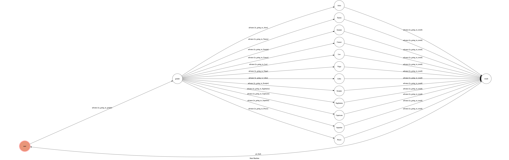

# TOC Project 2020

[](https://codeclimate.com/github/NCKU-CCS/TOC-Project-2020/maintainability)

[](https://snyk.io/test/github/NCKU-CCS/TOC-Project-2020)


Template Code for TOC Project 2020

A Line bot based on a finite state machine

## Setup

### Prerequisite
* Python 3.6
* Pipenv
* Facebook Page and App
* HTTPS Server

#### Install Dependency
```sh
pip3 install pipenv

pipenv --three

pipenv install

pipenv shell
```

* pygraphviz (For visualizing Finite State Machine)


#### a. Ngrok installation

**`ngrok` would be used in the following instruction**

```sh
ngrok http 8000
```

After that, `ngrok` would generate a https URL.

#### Run the sever

```sh
python app.py
```

#### b. Servo

Or You can use [servo](http://serveo.net/) to expose local servers to the internet.


## Finite State Machine


## Usage
The initial state is set to `user`.

Every time `user` state is triggered to `advance` to another state, it will `go_back` to `user` state after the bot replies corresponding message.

* user
	* Input: "男"
		* Reply:  "小王子 您好，請輸入您的生日～"
		* Enter state: "gender"
	* Input: "女"
		* Reply:  "小公主 您好，請輸入您的生日～"
		* Enter state: "gender"
* gender
	* Input: "1/21" ~ "2/19"
		* Reply:  "您是 水瓶座 喔～\n請輸入對方的生日!!!"
		* Enter state: "Aquarius"
	* Input: "2/20" ~ "3/20"
		* Reply:  "您是 雙魚座 喔～\n請輸入對方的生日!!!"
		* Enter state: "Pisces"
	* Input: "3/21" ~ "4/19"
		* Reply:  "您是 牡羊座 喔～\n請輸入對方的生日!!!"
		* Enter state: "Aries"
	* Input: "4/20" ~ "5/20"
		* Reply:  "您是 金牛座 喔～\n請輸入對方的生日!!!"
		* Enter state: "Taurus"
	* Input: "5/21" ~ "6/21"
		* Reply:  "您是 雙子座 喔～\n請輸入對方的生日!!!"
		* Enter state: "Gemini"
	* Input: "6/22" ~ "7/22"
		* Reply:  "您是 巨蟹座 喔～\n請輸入對方的生日!!!"
		* Enter state: "Cancer"
	* Input: "7/23" ~ "8/22"
		* Reply:  "您是 獅子座 喔～\n請輸入對方的生日!!!"
		* Enter state: "Leo"
	* Input: "8/23" ~ "9/22"
		* Reply:  "您是 處女座 喔～\n請輸入對方的生日!!!"
		* Enter state: "Virgo"
	* Input: "9/23" ~ "10/23"
		* Reply:  "您是 天秤座 喔～\n請輸入對方的生日!!!"
		* Enter state: "Libra"
	* Input: "10/24" ~ "11/21"
		* Reply:  "您是 天蠍座 喔～\n請輸入對方的生日!!!"
		* Enter state: "Scorpio"
	* Input: "11/22" ~ "12/20"
		* Reply:  "您是 射手座 喔～\n請輸入對方的生日!!!"
		* Enter state: "Sagittarius"
	* Input: "12/21" ~ "1/20"
		* Reply:  "您是 摩羯座 喔～\n請輸入對方的生日!!!"
		* Enter state: "Capricorn"
* Aries、Taurus、Gemini、Cancer、Leo、Virgo、Libra、Scorpio、Sagittarius、Capricorn、Aquarius、Pisces
    * Input: "xx/yy"
    	* Algorithm:  從男女生日配對得到男方星座、女方星座，藉由查表對應至星座速配指數並回傳、對應的分數區會得到對應的祝福語，自動回復到user
		* Reply:  
			* 指數 = 99: "你們最好不要在一起，不然赤道的太陽都沒你們閃＾＿＾"
			* 指數 = 90 - 99: "不追就是憑實力單身了喔＾＿＾"
			* 指數 = 80 - 89: "你們很配，錯失機會就準備當好朋友吧~"
			* 指數 = 70 - 79: "相處起來還挺不錯，真的啦～"
			* 指數 = 60 - 69: "時有火花、偶有摩擦\n幫他撥蝦、還算不差"
			* 指數 = 50 - 59: "其實最能長久的戀情，往往都不是最速配的愛情"
			* 指數 = < 50: "冤家"
		* Enter state: "user"

## Deploy
Setting to deploy webhooks on Heroku.

### Connect to Heroku

1. Register Heroku: https://signup.heroku.com

2. Create Heroku project from website

3. CLI Login

	`heroku login`

### Upload project to Heroku

1. Add local project to Heroku project

	heroku git:remote -a {HEROKU_APP_NAME}

2. Upload project

	```
	git add .
	git commit -m "Add code"
	git push -f heroku master
	```
